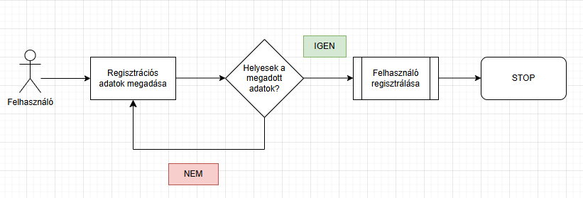
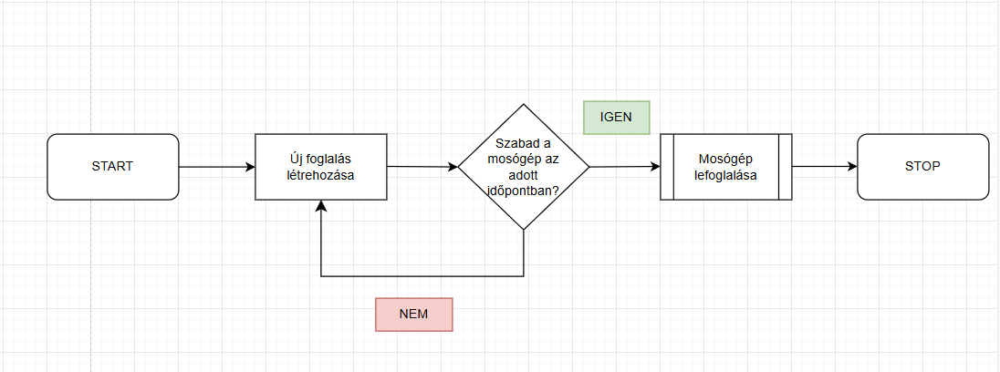
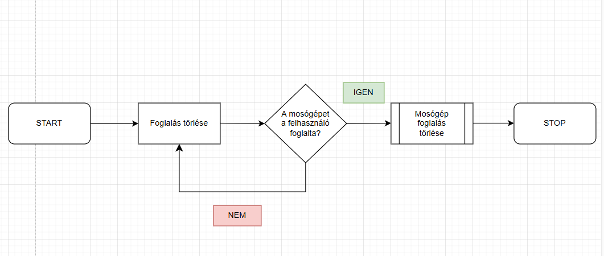
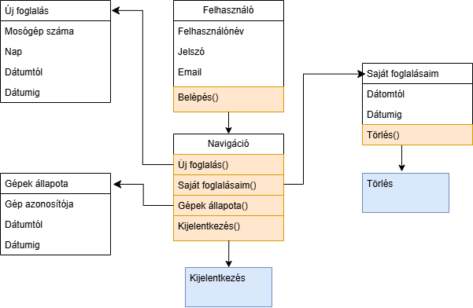
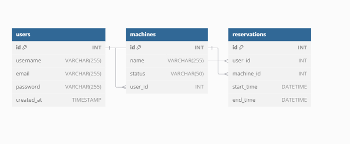

# Rendszerterv

## 1. A rendszer célja

A **SpeedWash** rendszer célja, hogy a felhasználók gyorsan és egyszerűen foglalhassanak mosógépeket egy online platformon keresztül. A rendszer célja továbbá, hogy valós idejű információkat nyújtson a szabad mosógépekről, valamint lehetőséget biztosítson a foglalások kezelésére.

---

## 2. Projekt terv

### 2.1 Projektszerepkörök és felelősségek

**Frontend fejlesztés**:

| Projektmunkás  |
| --------------- |
| Kornélia       |

| Felelősségek                                        |
| --------------------------------------------------- |
| A felhasználói felület kialakítása                  |
| Reszponzív dizájn létrehozása                       |
| Az API végpontok integrálása                        |

**Backend fejlesztés**:

| Projektmunkás  |
| --------------- |
| Krisztián      |

| Felelősségek                                        |
| --------------------------------------------------- |
| Backend szolgáltatások megvalósítása                |
| Adatbázis tervezése és implementálása               |
| Felhasználói hitelesítés és jogosultságkezelés      |

**Tesztelés**:

| Projektmunkások  |
| ---------------- |
| Kornélia         |
| Krisztián        |

| Felelősségek                                        |
| --------------------------------------------------- |
| Funkcionális és integrációs tesztek elvégzése       |
| Hibák felderítése és javítása                       |

---
### 2.2 Ütemterv

| Funkció                   | Feladat                                    |
| ------------------------- | ------------------------------------------ | 
| Követelmény specifikáció  | Követelmény specifikáció elkészítése       |
| Funkcionális specifikáció | Funkcionális specifikáció elkészítése      |
| Rendszerterv              | Rendszerterv és képernyőtervek elkészítése | 
| Adattárolás               | Adatmodell megtervezése és adatbázis létrehozása | 
| Honlap                    | Frontend és backend integráció             | 
| Tesztelés                 | Rendszer működésének ellenőrzése           |

---

### 2.3 Mérföldkövek

| Mérföldkövek                                  |
| ------------------------------------------- |
| Projektmunkák és felelősségek kiosztása     |
| Első működő prototípus bemutatása           |
| Végleges projekt tesztelése és átadása      |

---

## 3. Üzleti folyamatok modellje

A rendszert nem lehet regisztrálás nélkül használni. A látogató a kezdőoldalt képes elérni és azon keresztül bejelentkezni, vagy regisztrálni a rendszerbe. A bejelentkezett felhasználó képes mosó- és szárítógépeket foglalni, listázni, hogy ezek mikor elérhetőek és a saját foglalásait áttekinteni és törölni.

### **3.1 Üzleti szereplők**

A bejelentkezés minden felhasználó számára egységesen az alábbiak szerint történik:  
A kezdőoldalra lépve megjelenik egy beviteli űrlap, amely tartalmazza az „Email” és a „Jelszó” mezőket. A felhasználónak ki kell töltenie ezeket a mezőket, majd a **„Belépés”** gombra kattintva tud bejelentkezni.  
- **Sikeres azonosítás** esetén a felhasználó belép a rendszerbe, ahol a jogosultsági szintjének megfelelő felület jelenik meg.  
- **Sikertelen azonosítás** esetén hibaüzenet figyelmezteti a felhasználót a probléma pontos okára, például hibás email cím vagy jelszó esetén.

A rendszer két fő szereplőt különböztet meg:  

- **Felhasználók**:  
  Ők regisztrálnak a rendszerbe, foglalásokat hoznak létre, illetve megtekintik és kezelik azokat.  

- **Adminisztrátorok**:  
  Ők felelnek a rendszer zavartalan működéséért, például:  
  - Mosógépek adatainak karbantartása,  
  - Statisztikák megtekintése,  
  - Felhasználók és foglalások kezeléséhez kapcsolódó műveletek elvégzése.

---

### **3.2 Üzleti folyamatok**

#### **Felhasználói adatok megjelenítése**
| **Megnevezés**           |
|--------------------------|
| A felhasználó neve       |
| A felhasználó jelszava   |
| A felhasználó email címe |
| A felhasználó telefonszáma |

#### **Foglalások megtekintése és szűrése**
| **Megnevezés**                        |
|---------------------------------------|
| Foglalás szűrése ettől a dátumtól     |
| Foglalás szűrése eddig a dátumig      |
| Foglalt mosógép azonosítója           |
| Foglalás kezdete                      |
| Foglalás vége                         |

#### **Új foglalás rögzítése**
| **Megnevezés**           |
|--------------------------|
| Mosógép azonosítója      |
| Foglalás kezdő időpontja |

#### **Meglévő foglalások módosítása vagy törlése**
| **Megnevezés**           |
|--------------------------|
| Mosógép azonosítója      |
| Foglalás kezdő időpontja |
| Foglalás befejező időpontja |

---

### **3.3 Üzleti entitások**

| **Entitások**     |
|-------------------|
| Foglalás          |
| Mosógép           |
| Felhasználó       |

---

### **4. Követelmények**

#### **Regisztrált felhasználók lehetőségei**
- Regisztrációs adatok módosítása  
- Regisztráció törlése  
- Új foglalás rögzítése  
- Korábban rögzített foglalás módosítása  
- Korábban rögzített foglalás törlése  
- Foglalások lekérdezése, szűrése (dátum, időpont, mosógép alapján)  

#### **Adminisztrátorok lehetőségei**
- Bejelentkezési adatok módosítása (e-mail és jelszó)  
- Új mosógépek hozzáadása  
- Mosógépek állapotának módosítása  
- Adminisztrátor hozzáadása  
- Adminisztrátorok és felhasználók törlése  
- Felhasználók listájának megtekintése  
- Statisztikai adatok megtekintése a mosógépek kihasználtságáról és a foglalások alakulásáról  

---

### **Funkcionális követelmények**
- A rendszer használatához kötelező az előzetes regisztráció.  
- Regisztrált felhasználók számára elérhető a bejelentkezés után:  
  - Foglalások kezelése (létrehozás, módosítás, törlés).  
  - Saját foglalások megtekintése és szűrése.  
- Adminisztrátor jogosultságokkal elérhető funkciók:  
  - Mosógépek adminisztrációja (hozzáadás, állapotmódosítás).  
  - Felhasználói adatkezelés (listázás, törlés).  
  - Foglalási statisztikák és kihasználtsági adatok megtekintése.  

---

### **Nemfunkcionális követelmények**
- **Egyszerű használat**: A rendszer felhasználóbarát kialakítású, gyorsan és könnyen elsajátítható.  
- **Képzettség**: Felhasználói szintű informatikai ismeretek elegendőek a használathoz.  
- **Oktatásmentes bevezetés**: A rendszer használata nem igényel előzetes oktatást.  
- **Telepítési környezet**:  
  - A rendszer egy szerver számítógépen kerül üzembe helyezésre.  
  - A futtatáshoz az alábbiak szükségesek:  
    - **XAMPP környezet**, amely tartalmazza az alábbiakat:  
      - Apache webszerver  
      - MySQL adatbázis szerver  
      - PHP futtatókörnyezet  
  - **Beállítások a XAMPP-ban**:  
    - A projektfájlokat a `htdocs` mappában kell elhelyezni.  
    - A MySQL adatbázis konfigurációja elérhető a `phpMyAdmin` felületen keresztül.  
    - A rendszer működésének ellenőrzéséhez a böngészőben a `http://localhost/<projekt_mappa>` URL használható.  
    - A `config.inc.php` fájlban szükség szerint megadható az adatbázis jelszava és egyéb paraméterei.  

### Európai uniós rendeletek, irányelvek, ajánlások

1. **AZ EURÓPAI PARLAMENT ÉS A TANÁCS (EU) 2016/679 RENDELETE (2016. április 27.)**
   - Más néven: Általános Adatvédelmi Rendelet (GDPR).
   - A természetes személyek személyes adatainak védelme, valamint az ilyen adatok szabad áramlásának biztosítása.
   - Az adatkezelés során biztosítani kell az adatkezelés jogalapját, az adatok célhoz kötöttségét, valamint az érintettek jogainak érvényesülését (hozzáférés, helyesbítés, törlés, adathordozhatóság).

2. **A Bizottság 2011/711/EU ajánlása (2011. október 27.)**
   - Kulturális anyagok digitalizálásáról és online hozzáférhetőségéről, valamint a digitális megőrzésről szóló irányelv.
   - Az elektronikus dokumentumok és adatok megőrzésére, valamint a digitális platformokon való elérhetőségük biztosítására vonatkozó ajánlások.

3. **98/34/EK európai parlamenti és tanácsi irányelv**
   - A műszaki szabványok és szabályok, valamint az információs társadalom szolgáltatásaira vonatkozó szabályok egységesítése érdekében létrehozott információszolgáltatási eljárásokról.

4. **96/9/EK irányelv (1996. március 11.)**
   - Az adatbázisok jogi védelméről.
   - Az adatbázisokat készítők szellemi tulajdonának védelme érdekében kialakított jogi keretrendszer.

### Magyarországi jogszabályok

1. **2011. évi CXII. törvény - Az információs önrendelkezési jogról és az információszabadságról (Infotv.)**
   - Az érintettek adatainak védelmét szabályozza Magyarországon.
   - Az adatkezelők számára előírja az adatkezelési tevékenységek átláthatóságát, valamint az érintettek jogainak biztosítását.

2. **2018. évi LIII. törvény az adózás rendjéről**
   - Előírja az elektronikus nyilvántartások és adatszolgáltatások szabályozását az adóhatóság irányába.
   - Az adatbiztonság és a naplózás kötelező előírásait fogalmazza meg.

3. **2013. évi V. törvény - A Polgári Törvénykönyv**
   - Tartalmazza a szerzői jogok és a szellemi tulajdon védelmére vonatkozó szabályokat.

4. **2001. évi CVIII. törvény - Az elektronikus kereskedelmi szolgáltatások, valamint az információs társadalommal összefüggő szolgáltatások egyes kérdéseiről**
   - Meghatározza az elektronikus kereskedelmi tevékenységekre vonatkozó szabályokat.
   - Tartalmazza a szolgáltatók adatkezelési és információszolgáltatási kötelezettségeit.

5. **2018. évi LIV. törvény az üzleti titok védelméről**
   - Biztosítja a gazdasági tevékenység során keletkező üzleti titkok védelmét.

### További előírások

1. **ISO/IEC 27001 szabvány**
   - Az információbiztonsági irányítási rendszerek követelményeit meghatározó nemzetközi szabvány.
   - Az adatvédelem és biztonság érdekében javasolt alkalmazni.

2. **ISO/IEC 12207 szabvány**
   - A szoftver életciklusára vonatkozó szabvány, amely az alkalmazás fejlesztési és üzemeltetési szakaszaira vonatkozik.

3. **NIS irányelv**
   - Az Európai Unió kiberbiztonsági irányelve, amely a hálózati és információs rendszerek biztonságának fokozását célozza.

A fent említett rendeletek és irányelvek biztosítják, hogy a rendszer megfeleljen a jogszabályi követelményeknek és szabványoknak, miközben garantálja a felhasználók adatainak biztonságát és a szolgáltatások megbízhatóságát.

---

# **5. Funkcionális terv**

## **5.1 Rendszerszereplők**
A rendszer használatához szükséges az előzetes regisztráció az oldalon keresztül. A rendszerbe regisztrált felhasználók képesek:  
- Új mosógép-foglalásokat rögzíteni.  
- Meglévő foglalásaikat megtekinteni, módosítani vagy törölni.  
- A foglalásokat dátum és idő szerint szűrni.  

Az adminisztrátorok ezen túlmenően jogosultak:  
- Mosógépek állapotának kezelésére.  
- Felhasználói fiókok adminisztrációjára.  
- Statisztikai adatok megtekintésére.  

---

## **5.2 Rendszerhasználati esetek és lefutásaik**

### **Regisztráció**
A regisztrációs folyamat során a felhasználó megadja az e-mail címét, nevét, és jelszavát. A rendszer ellenőrzi a megadott adatok formátumát, majd a validált adatokat elmenti az adatbázisba.

**UML diagram: Regisztráció**  
_Elkészítve a rendszer szereplőivel és a folyamatlépésekkel._  

---

### **Új foglalás hozzáadása**
A felhasználók új foglalásokat rögzítenek a mosógépekhez. A rendszer ellenőrzi a foglalás időpontját és a mosógép állapotát, hogy elkerülje az ütközéseket.

**UML diagram: Új foglalás hozzáadása**  

---

### **Foglalás törlése**
A felhasználók törölhetik a meglévő foglalásaikat. A törlési kérelmet a rendszer az adatbázisban hajtja végre, és eltávolítja a foglalást.

**UML diagram: Foglalás törlése**  

---

## **5.3 Határ osztályok**
A határosztályok felelősek a felhasználói interakciók kezeléséért, beleértve az adatok bevitelét, ellenőrzését és továbbítását az üzleti logikához.  

**UML diagram: Határosztályok**  

---

## **5.4 Menühierarchiák**

### **Elérhető funkciók regisztráció nélkül:**
- Bejelentkezés  
- Regisztráció  

### **Elérhető funkciók regisztrációval:**
- Új foglalás rögzítése  
- Foglalások megtekintése  
- Foglalások törlése  

# 6. Fizikai környezet

## 6.1 Platformok
- PHP 8.1
- MySQL 8.0
- JavaScript ES6
- HTML5
- CSS3

## 6.2 Vásárolt szoftverkomponensek és külső rendszerek
- **Vásárolt szoftverkomponensek**: Nincsenek.
- **Ingyenes szoftverkomponensek**:
  - Bootstrap CSS framework a reszponzív felhasználói felület kialakításához.
  - FontAwesome ikonok felhasználása a vizuális elemek javítása érdekében.

## 6.3 Hardver és hálózati topológia
Az alkalmazás egy webplatformra készül, amely bármilyen operációs rendszerrel kompatibilis, amely támogatja a következő technológiákat:
- Böngésző, amely támogatja a modern szabványokat (pl. Google Chrome, Mozilla Firefox, Microsoft Edge).
- A webszerver XAMPP csomagban futtatott Apache HTTP szervert és MySQL adatbázist használ.
- Hardverkövetelmények:
  - Minimum 2 GHz processzor.
  - 4 GB RAM a fejlesztési és tesztelési környezethez.
  - 10 GB szabad tárhely a rendszer és az adatbázis tárolásához.

## 6.4 Fizikai alrendszerek
- **Webszerver**: 80-as porton futó Apache HTTP szerver a XAMPP környezetben.
- **Adatbázisszerver**: MySQL adatbázis a felhasználói adatok, foglalások és mosógépek nyilvántartására.
- **Kliensoldali követelmények**:
  - Böngésző, amely támogatja a JavaScript-et, HTML5-öt és CSS3-at.
  - Eszköz: asztali számítógép, laptop vagy okostelefon.

## 6.5 Fejlesztő eszközök
- Visual Studio Code: A kód fejlesztéséhez és szerkesztéséhez.
- MySQL Workbench: Az adatbázis kezeléséhez és tervezéséhez.
- GitHub: Verziókövetés és csapatmunka támogatása.
- Postman: API teszteléshez.
- XAMPP: Lokális szerverkörnyezet biztosításához (Apache, MySQL, PHP).

# 7. Architekturális terv

A **Backend** PHP programozási nyelven készül objektumorientált programozás (OOP) alapokon. Az alkalmazás megvalósítása az MVC (model-view-controller) tervezési minta szerint történik, amely elválasztja az üzleti logikát, az adatokat, és a megjelenítést.

A **Frontend** HTML, CSS, JavaScript és PHP technológiákat használ. Az alkalmazás felépítése elkülönülő modulokból áll, amelyek:
- **Header (fejléc)**: A navigációs menük és az oldal azonosító elemei találhatók itt.
- **Navigation (navigáció)**: Az alkalmazás nézeteinek közötti navigáció biztosítása.
- **Content (tartalom)**: A nézetek tartalmi része (pl. mosógépek listázása, foglalások kezelése).
- **Footer (lábléc)**: Információs elemek (pl. szerzői jog, kapcsolat).

Az alkalmazás könnyen karbantartható és bővíthető, az egyes komponensek elkülönítése révén.

## 7.1 Az alkalmazás rétegei, fő komponensei, ezek kapcsolatai

Az alkalmazás több rétegre épül, amelyek egymással kapcsolatban állnak:

- **Kliensoldal**: A felhasználók webböngésző segítségével érik el az alkalmazást. A felületet HTML, CSS, és JavaScript biztosítja.
- **Szerveroldal**: A PHP alapú backend kezeli az üzleti logikát, a felhasználói kérések validálását és feldolgozását.
- **Adatbázis**: A MySQL adatbázis tárolja a felhasználói adatokat, foglalásokat, és a mosógépek információit.

A CRUD (Create, Read, Update, Delete) műveletek HTTP POST, GET és DELETE metódusokkal kerülnek átadásra szerver-kliens relációban. Az adatokat a MySQL adatbázisban tároljuk, az Apache webszerveren futtatva az alkalmazást.

## 7.2 Változások kezelése

Az alkalmazás változtatásait szerveroldalon végezzük. A módosítások a PHP backend és az adatbázis rétegben történnek, a felhasználónak nincs szüksége manuális beavatkozásra. A frontend automatikusan alkalmazza a szerveroldali frissítéseket a böngészőn keresztül.

## 7.3 Rendszer bővíthetősége

A rendszer könnyen bővíthető új funkciókkal vagy további felhasználói igények kielégítésére. A következő bővítési lehetőségeket biztosítja:
- Új funkciók hozzáadása a backend és frontend moduláris felépítése miatt.
- Nagyobb adatmennyiség kezelése az adatbázis optimalizálásával.
- További szervergépek csatlakoztatása a terheléselosztás érdekében.

A vékony kliensoldali megközelítés miatt nincs szükség külön beavatkozásra a felhasználói oldalon a rendszer bővítésekor.

## 7.4 Biztonsági funkciók

Az alkalmazás a következő biztonsági megoldásokat használja:
- **CSRF védelem**: A rendszer CSRF-tokeneket használ az űrlapok és kérések hitelességének ellenőrzésére. Ez biztosítja, hogy minden kérés a weboldalon keresztül történjen.
- **Jelszó titkosítás**: A felhasználói jelszavakat a PHP `password_hash()` függvényével kódoljuk, így azok biztonságosan kerülnek tárolásra.
- **Session alapú hitelesítés**: Bejelentkezéskor egyedi token készül, amelyet a szerver PHP session-ben tárol. Ez garantálja, hogy a felhasználó hozzáférése védett legyen.
- **Adatbázis lekérdezések biztonsága**: Az SQL Injection elleni védelem érdekében minden adatbázis lekérdezés paraméterezett SQL-t használ.

Ezek a megoldások biztosítják a felhasználói adatok és a rendszer integritásának védelmét.

# 8. Adatbázisterv

## **Felhasználók tábla**

| Mezőnév       | Megnevezés                                         | Jellemzi                     |
|---------------|----------------------------------------------------|------------------------------|
| ID            | Felhasználó azonosító                              | Elsődleges kulcs            |
| Név           | A felhasználó neve                                 |                              |
| Email cím     | A felhasználó email címe                           |                              |
| Jelszó        | A felhasználó jelszava                             |                              |
| Telefonszám   | A felhasználó telefonszáma                         |                              |
| Admin         | A felhasználó normál vagy adminisztrátor jogkörrel |                              |
| Valid         | A felhasználó érvényessége a rendszerben           |                              |

---

## **Mosógépek tábla**

| Mezőnév       | Megnevezés                                  | Jellemzi                     |
|---------------|---------------------------------------------|------------------------------|
| ID            | Mosógép azonosító                          | Elsődleges kulcs            |
| Név           | A mosógép neve                             |                              |
| Típus         | A mosógép típusa                           |                              |
| Állapot       | A mosógép aktuális állapota (pl. szabad/foglalt) |                              |
| Karbantartás  | A mosógép karbantartási időszaka            |                              |

---

## **Foglalások tábla**

| Mezőnév       | Megnevezés                                  | Jellemzi                     |
|---------------|---------------------------------------------|------------------------------|
| ID            | Foglalás azonosító                         | Elsődleges kulcs            |
| Felhasználó ID| A foglalást létrehozó felhasználó azonosító | Külső kulcs                 |
| Mosógép ID    | A foglalt mosógép azonosítója               | Külső kulcs                 |
| Kezdési idő   | A foglalás kezdési időpontja                |                              |
| Befejezési idő| A foglalás befejezési időpontja             |                              |
| Valid         | A foglalás érvényessége                    |                              |

---

---

## **Adattárolási szabályok**
1. A **Felhasználók tábla** tartalmazza a rendszer összes regisztrált felhasználójának adatait, beleértve az adminokat is.
2. A **Mosógépek tábla** tárolja a rendszerben elérhető mosógépek adatait és azok állapotát.
3. A **Foglalások tábla** a felhasználók által létrehozott foglalásokat tartalmazza, kapcsolatot teremtve a felhasználók és a mosógépek között.

---

## **Egyed-Kapcsolat diagram**
Az adatbázis három fő entitása:
- **Felhasználók**: kapcsolatban áll a foglalásokkal (1:N kapcsolat).
- **Mosógépek**: kapcsolatban áll a foglalásokkal (1:N kapcsolat).
- **Foglalások**: tartalmazza a felhasználó és a mosógép közötti kapcsolatot.

**Kapcsolatok:**
- A **Foglalások** tábla a **Felhasználók** és a **Mosógépek** táblával külső kulcsokon keresztül kapcsolódik.
